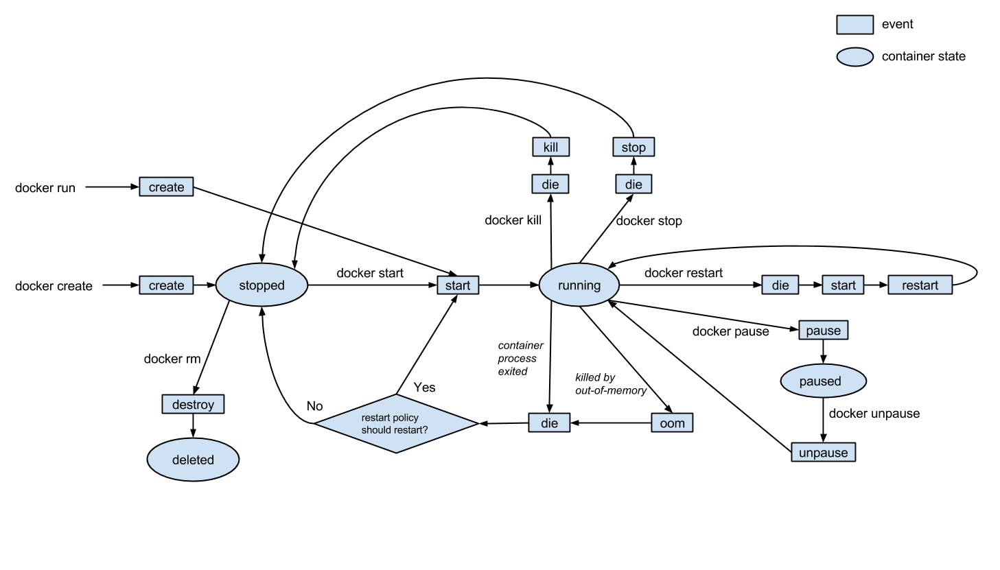

# docker 
## Docker Events Flow

## Commands reference 
### inspect layers
docker inspect --format "{{.RootFS.Layers}}" microsoft/nanoserver
## Docker help pages
### Good Reads
https://github.com/veggiemonk/awesome-docker#what-is-docker  
https://blog.docker.com/2017/11/tips-tricks-docker-captains  
https://sreeninet.wordpress.com/2017/08/15/docker-features-for-handling-containers-death-and-resurrection/  
https://medium.com/devopsion/life-and-death-of-a-container-146dfc62f808  
https://www.ctl.io/developers/blog/post/gracefully-stopping-docker-containers  
https://medium.com/@gchudnov/trapping-signals-in-docker-containers-7a57fdda7d86  
### foreign layers
https://vorcunus.blog/2017/05/31/push-windows-image-layers-to-harbor-registry/  
### nsenter
https://github.com/jpetazzo/nsenter  
### view host filesystem of docker container
http://www.vivekjuneja.in/tips/2016/12/02/docker-1.12.3-view-host-fs/
